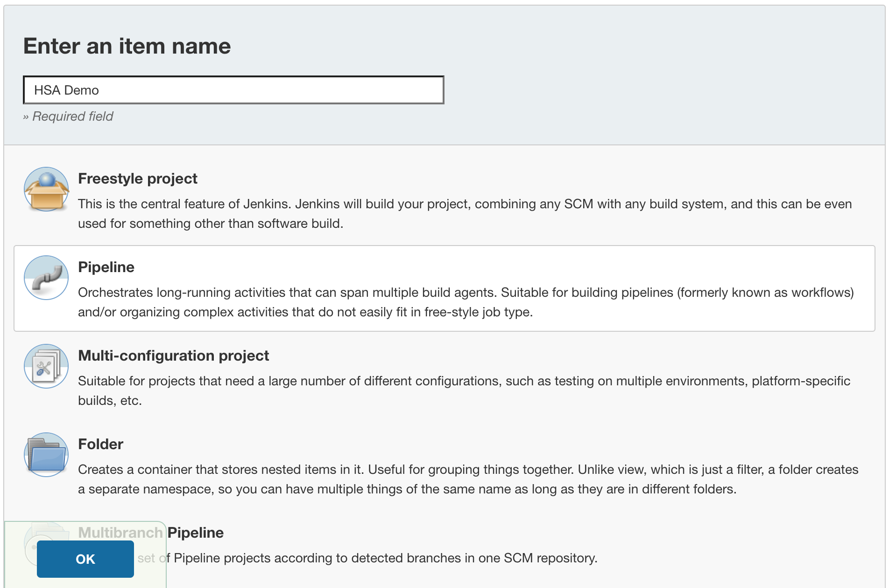
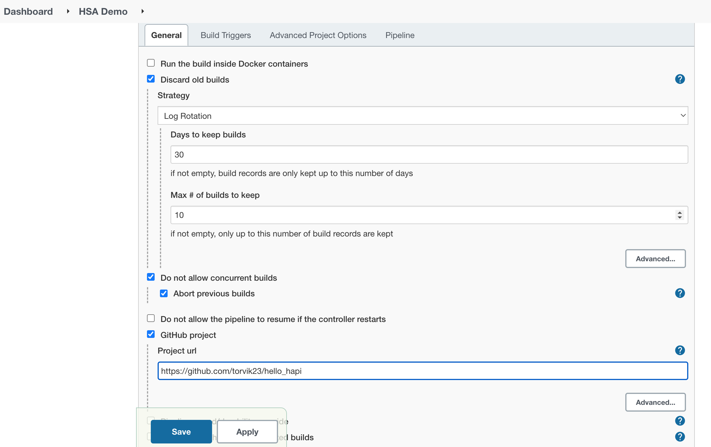
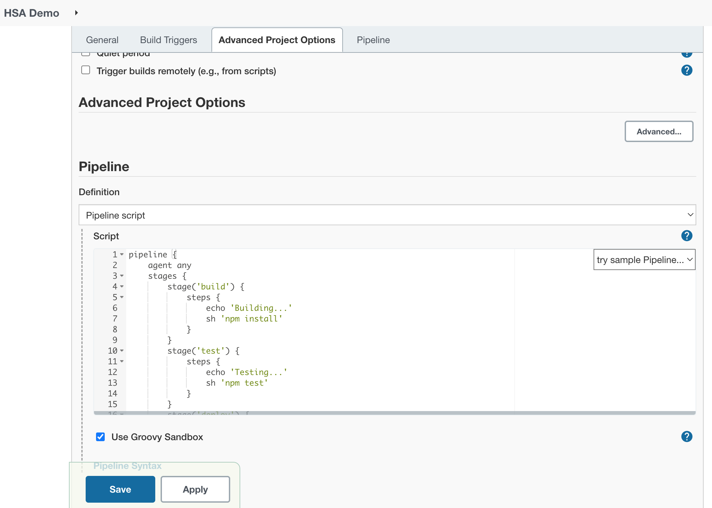
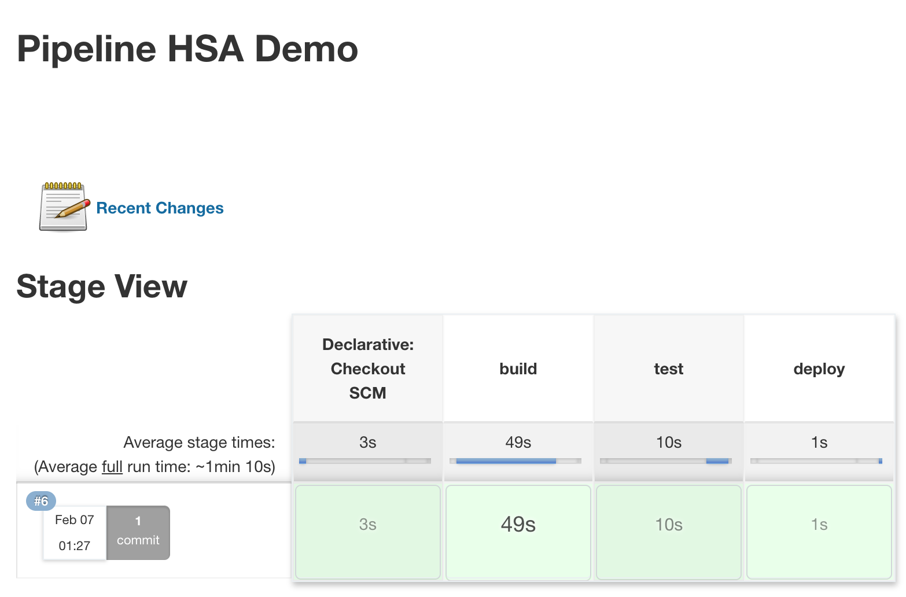

# HSA L22: Continuous Deployment

## Overview
This is an example project to show how to set up a CI/CD for the project.

## Getting Started

### Preparation

1. Run the docker containers.
```bash
  docker-compose up -d
```

Be sure to use ```docker-compose down -v``` to clean up after you're done with tests.

2. Go to `http://localhost:8090/`. if you didn’t change your default port mapping
3. Authenticate from the web app.
* Default username is `admin`.
* Default password is `docker-compose exec jenkins cat /var/jenkins_home/secrets/initialAdminPassword`
4. Install some plugins.
5. Create your user, or continue as Admin:

Note: to add user go to `http://localhost:8090/securityRealm/addUser` and to restart it from the web app visit `http://localhost:8090/restart`.

## Create Pipeline and Build it.
1. Enter a name for your new pipeline.

Click the OK button at the bottom to move on.

2. Enter your demo project’s GitHub repository URL.


3. Add Pipeline script and save the job.
```groovy
pipeline {
    agent any
    stages {
        stage('build') {
            steps {
                echo 'Building...'
                sh 'npm install'
            }
        }
        stage('test') {
            steps {
                echo 'Testing...'
                sh 'npm test'
            }
        }
        stage('deploy') {
            steps {
                echo 'Deploying...'
            }
        }
    }
}
```


4. Run the pipeline.
